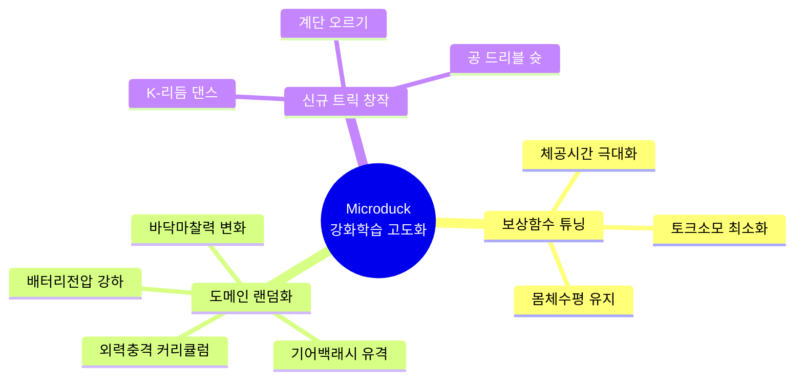

# 🦆 [공부방 과제 보고서] Microduck 피지컬 AI 로봇 제작 & 강화학습(RL) 고도화 연구

> **과제 주제**: Microduck 오리 로봇 실물 제작 부품 리스트 및 강화학습(PPO) 성능 극대화 방안 연구  
> **제출 기한**: 다음 주 월요일까지  
> **총괄 검토**: 대표님  
> **실무 연구**: 에이전트 총괄부장 코다리  

---

## 🛠️ PART 1. Microduck 실물 로봇 제작 준비물(BOM) & 구매처 체크리스트

| 구분 | 부품명 | 수량 | 주요 구매처 및 가격대 | 비고 |
| :--- | :--- | :---: | :--- | :--- |
| **관절 모터** | **로보티즈 다이나믹셀 XL330** (`XL330-M288-T` 또는 `M077-T`) | 14개 | **로보티즈 공식몰 / 디바이스마트 / 엘레파츠** (개당 약 2.4만 ~ 3만 원대) | 다리 10개 (좌5/우5) + 목/머리 4개 |
| **통신 어댑터** | **로보티즈 U2D2 + 전원허브** | 1세트 | **로보티즈 e-Shop / 네이버 스토어** (약 2.5만 ~ 4만 원대) | PC/라즈베리파이와 14개 모터 USB 통신 연결 |
| **온보드 PC** | **라즈베리파이 4B or 5 (4GB+)** | 1개 | **국내 전자기기몰 / 쿠팡** (약 8만 ~ 12만 원) | 훈련된 `.onnx` 신경망 50Hz 실시간 추론 구동 |
| **전원 배터리** | **2S LiPo 배터리 (7.4V, ~1000mAh)** | 1~2개 | **RC 부품몰 / 네이버 스토어** (약 1.5만 ~ 2.5만 원) | XL330 권장 전압 7.4V 공급 |
| **외골격 프레임** | **3D 프린팅 부품 일체 (PLA/PETG)** | 1세트 | **3D 프린터 직접 출력 (STL 무료 공개)** | 머리, 부리, 다리, 골반, 몸체 케이스 |
| **체결 부속** | M2/M2.5 볼트 및 너트 세트 | 1박스 | 디바이스마트 / 볼트몰 (약 5천 원) | 조립용 볼트 |

---

## 🧠 PART 2. "이 친구를 어떻게 더 잘 훈련시킬 것인가?" (강화학습 고도화 5대 핵심 전략)

### 1. 🎯 보상 함수(Reward Function) 정밀 튜닝 (자연스럽고 우아한 보행)
* **현재 문제**: 단순 속도 추종만 강조하면 로봇이 발을 질질 끌거나 모터에 과부하가 걸리는 기괴한 자세가 나옴.
* **고도화 방안**:
  1. **발 떼기/착지 명확화 (`feet_air_time_reward`)**: 발이 공중에 떠 있는 체공 시간을 보상하여 또박또박 걷게 유도.
  2. **에너지 효율성 (`torque_penalty` & `action_rate_penalty`)**: 모터 토크 소모와 급격한 각도 변화에 페널티를 주어 부드럽고 배터리가 오래가는 걸음걸이 완성.
  3. **몸체 수평 유지 (`upright_reward`)**: 몸체 롤/피치 각도가 수평을 벗어날수록 감점하여 시선이 항상 안정되도록 제어.

---

### 2. 🌪️ 도메인 랜덤화 (Domain Randomization) 극대화 (Sim2Real 격차 제로)
* **목표**: 가상 시뮬레이터(MuJoCo)와 실제 현실 세계의 오차를 박살 내는 기법.
* **적용 파라미터**:
  * **전압 강하(Voltage Sag)**: 배터리 잔량이 줄어들 때 모터 힘이 빠지는 현상을 시뮬레이터에 무작위 주입 (6.5V ~ 8.4V).
  * **기어 유격(Backlash)**: 모터 기어가 닳았을 때 생기는 ±1.5° 유격을 가상 환경에 반영하여 흔들림 방지.
  * **바닥 마찰력 (Friction Variation)**: 미끄러운 마루바닥(0.4)부터 거친 카펫(1.2)까지 무작위로 섞어서 훈련.
  * **랜덤 외력 충격 (Push Curriculum)**: 훈련 후반부로 갈수록 로봇을 강하게 밀치는 빈도를 늘려 어떤 충격에도 넘어지지 않는 '무적 낙법' 학습.

---

### 3. 📈 커리큘럼 러닝 (Curriculum Learning) 단계별 훈련법
* **1단계 (평지 정적 균형)**: 제자리 서기 및 고개 돌리기 (기본 자세 확립).
* **2단계 (평지 전후좌우 보행)**: 저속(0.1m/s) ➔ 고속(0.5m/s) 점진적 가속.
* **3단계 (험지 & 경사로)**: 5°~15° 오르막/내리막길 및 울퉁불퉁한 요철 지형 돌파.
* **4단계 (외력 복원 및 트릭)**: 넘어졌을 때 배/등을 대고 스스로 일어서기, 앞구르기 연계.

---

### 4. ⚡ PPO 하이퍼파라미터 최적화 (안정적 수렴)
* **보폭 제한 (`clip_range = 0.2`)**: 학습 중 정책이 급변하여 뇌진탕(Catastrophic Forgetting)에 빠지는 현상 방지.
* **엔트로피 계수 스케줄링 (`entropy_coef`)**: 
  * 초반(0.01): 다양한 엉뚱한 시도를 해보며 새로운 걸음걸이 탐색.
  * 후반(0.001): 완성된 걸음걸이를 정밀하게 다듬기.
* **대규모 병렬 환경 (`num_envs = 4096`)**: GPU 가속(MuJoCo Warp)을 통해 가상 시간 10년 치 보행 데이터를 단 1시간 만에 압축 학습.

---

### 5. 🎪 신규 창작 태스크 (Microduck 킬러 트릭 후보)
1. **[K-오리 댄스 모드]**: 음악 비트에 맞춰 몸을 좌우로 흔들며 고개를 끄덕이는 리듬 보행 정책.
2. **[계단 오르내리기]**: 3cm 높이의 미니 계단을 부리로 거리 측정하며 정복하는 정책.
3. **[공 드리블 & 골 넣기]**: 비전 센서(카메라)와 연동하여 노란 공을 골대까지 몰고 가는 엔드투엔드 스포츠 모드.

---

## 📅 PART 3. 다음 주 월요일까지의 주간 연구 실천 계획표

| 일정 | 목표 및 액션 아이템 |
| :---: | :--- |
| **D-1 (화)** | `microduck_rl` 소스코드 내 보상 함수 파일(`mdp.py`, `microduck_velocity_env_cfg.py`) 구조 정밀 분석 |
| **D-2 (수)** | 보행 속도 및 에너지 페널티 가중치 수정 후 로컬/클라우드 재학습 실험 |
| **D-3 (목)** | 새로운 ONNX 두뇌 파일 추출 후 3D 시뮬레이터에서 신규 걸음걸이 비교 테스트 |
| **D-4 (금)** | 3D 프린터 부품 도면(STL) 치수 검토 및 모터/전원 배선도 정리 |
| **D-5 (토~일)**| 최종 연구 보고서 슬라이드/노트 완성 및 대표님 결재 보고 |

---

