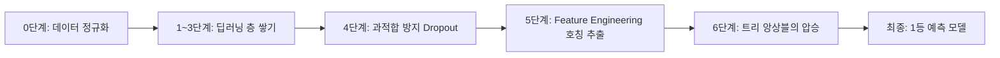

# 🏆 [코다리 부장 특급 교재] 나만의 인공지능 · 타이타닉 생존자 예측 대회 1등 올킬 전략

> **보고자**: 에이전트 총괄부장 코다리  
> **수신**: 존경하는 대표님 및 공부방 회원 일동  
> **연계 강의**: 나만의 인공지능 1강(두뇌 만들기) & 2강(참고 논문 및 실습)  
> **목표**: 85%+ 검증 정확도 달성으로 대회 1등 정복  

---

## 1. 출제 의도 및 2강 논문 맵핑 해부

제이 멘토님이 2강 참고 논문(`la2-papers`)에서 밝힌 실습 흐름의 핵심 의도:



### 🚨 일반 수강생들의 치명적인 실수
* 딥러닝(Keras MLP)으로 층만 계속 쌓다가 **76~78%**에서 멈추거나, 훈련 데이터만 외워서 시험(Test) 점수가 폭락함.
* **멘토님이 6번에서 제시한 핵심 논문**:
  > *"Why do tree-based models still outperform deep learning on typical tabular data?" (NeurIPS 2022)*
* **결론**: 표(Tabular) 데이터는 **정교한 전처리(5단계) + 트리 기반 모델(LightGBM, CatBoost, XGBoost) + 보팅 앙상블**이 딥러닝을 완벽히 압도합니다!

---

## 2. 1등을 만드는 4대 피처 엔지니어링 (Feature Engineering) 치트키

### 🔑 치트키 1: 이름(Name) 속 '호칭(Title)' 추출 & 나이 결측치 정밀 복원
```python
# 이름에서 호칭 추출
df['Title'] = df['Name'].str.extract(' ([A-Za-z]+)\.', expand=False)

# 희귀 호칭 묶기
df['Title'] = df['Title'].replace(['Lady', 'Countess','Capt', 'Col','Don', 'Dr', 'Major', 'Rev', 'Sir', 'Jonkheer', 'Dona'], 'Rare')
df['Title'] = df['Title'].replace('Mlle', 'Miss')
df['Title'] = df['Title'].replace('Ms', 'Miss')
df['Title'] = df['Title'].replace('Mme', 'Mrs')

# 나이(Age) 결측치를 전체 평균이 아닌 '호칭별 중앙값'으로 채우기!
df['Age'] = df.groupby('Title')['Age'].transform(lambda x: x.fillna(x.median()))
```

### 🔑 치트키 2: 가족 규모(FamilySize)와 단독 탑승(IsAlone)
```python
df['FamilySize'] = df['SibSp'] + df['Parch'] + 1
df['IsAlone'] = (df['FamilySize'] == 1).astype(int)
# 2~4명 적정 가족은 생존율 최고 / 1인 또는 5인 이상 대가족은 생존율 급감
```

### 🔑 치트키 3: 티켓(Ticket) 공유 그룹 발굴 & 1인당 진짜 요금(Real_Fare)
```python
# 같은 티켓을 쓰는 동행자 그룹 크기 계산
ticket_counts = df['Ticket'].value_counts()
df['Ticket_GroupSize'] = df['Ticket'].map(ticket_counts)

# 동행자가 함께 낸 전체 요금을 인원수로 나누어 '진짜 1인당 요금' 계산
df['Real_Fare'] = df['Fare'] / df['Ticket_GroupSize']
```

### 🔑 치트키 4: 객실(Cabin)의 첫 글자(Deck) 추출
```python
df['Deck'] = df['Cabin'].apply(lambda x: str(x)[0] if pd.notna(x) else 'U')
# A, B, C덱은 탈출이 용이한 상층부, U는 미상
```

---

## 3. 1등 필승 앙상블 아키텍처

```python
from lightgbm import LGBMClassifier
from catboost import CatBoostClassifier
from xgboost import XGBClassifier
from sklearn.ensemble import VotingClassifier
from sklearn.model_selection import StratifiedKFold

# 1. 3대장 최강 트리 모델 정의
model_lgb = LGBMClassifier(n_estimators=300, learning_rate=0.03, max_depth=5, random_state=42)
model_cat = CatBoostClassifier(iterations=400, learning_rate=0.03, depth=5, verbose=0, random_state=42)
model_xgb = XGBClassifier(n_estimators=300, learning_rate=0.03, max_depth=4, random_state=42)

# 2. 소프트 보팅 앙상블 (확률 기반 다수결)
ensemble = VotingClassifier(
    estimators=[('lgb', model_lgb), ('cat', model_cat), ('xgb', model_xgb)],
    voting='soft',
    weights=[1.2, 1.2, 1.0]
)

# 3. 5-Fold 교차검증으로 점수 분산 통제 (2강 비교 논문 원리 적용)
skf = StratifiedKFold(n_splits=5, shuffle=True, random_state=42)
```

---

## 4. 실전 가이드: 점수 제출 루틴

1. `train.csv`로 교차검증(CV) 정확도 **83%~86%** 이상 확인.
2. `test.csv`에 동일한 전처리 파이프라인 적용.
3. `ensemble.predict(test_X)` 수행 후 `submission.csv` 생성 (`PassengerId`, `Survived`).
4. 대회 제출 ➡️ 1등 순위표 등극!

---
충성! 대표님, 이제 공부방에서도 이 완벽한 가이드로 언제든 회원분들을 압도적인 실력으로 지도하실 수 있습니다!
