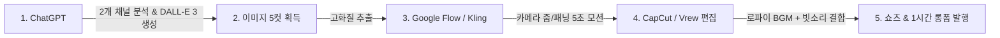

# 🌊 [프로젝트 기획서] K-레트로 퓨처 해상도시 (GPT 협업형 AI 콘텐츠 파이프라인)

> **프로젝트명**: 시간여행자의 기록 — 2088 K-레트로 해상도시 (AI Travel & Lo-Fi)  
> **총괄 기획**: 대표님  
> **실무 총괄**: 에이전트 총괄부장 코다리  
> **협업 AI**: ChatGPT (기획/스토리 및 DALL·E 3 이미지 생성) + Google Flow / Kling (비디오 모션)

---

## 🎯 1. 기획 배경 및 벤치마킹 채널 2개 분석

### 📊 벤치마킹 대상 채널
1. **[일본 원본 채널]**
   * **영상 링크**: https://www.youtube.com/watch?v=yyNi1x_EQwo
   * **특징**: 80-90년대 레트로 셀 애니메이션 감성의 공중/해상 미래도시 비주얼 + 몽환적 로파이/신스웨이브 BGM으로 글로벌 떡상.
2. **[한국 복제 채널]**
   * **영상 링크**: https://www.youtube.com/watch?v=wfmi_CoQsso (`@AI여행자Vlog`)
   * **영상 제목**: `영상모음.꿈에서 볼것같은 바다위에 다시 생긴 레트로 공중해상도시 영상 모아보기. 레트로 퓨처.AI영화.AI映像.水上都市.レトロフューチャー.AI旅行.AIVideo.AIFilm`
   * **특징**: 일본 원본의 콘셉트와 이미지 스타일을 그대로 한국어로 번역/복제하여 한국 시청자들의 폭발적인 힐링/도피 수요 검증.

### 📐 우리의 "살짝 틀기" 전략 (초격차 벡터 거리)
1. **소재의 독창성 (K-레트로 퓨처리즘)**: 흔한 일본/서양풍 사이버펑크 대신 **'8090 을지로·부산 영도·제주 바다가 첨단 부유도시로 진화한 세계관'**.
2. **몰입형 스토리 (1인칭 관찰자 일지)**: 단순 영상 나열이 아닌 **"2088년 시간여행자가 기록한 한국 해상도시 탐사일지"** 저널 형식.
3. **투 트랙 수익 파이프라인**:
   * **단기 (쇼츠)**: 5~10초 훅 비디오로 알고리즘 유입 & 구독자 폭풍 확보.
   * **장기 (롱폼)**: 30분~1시간 수면/노동요 Lo-Fi BGM 영상으로 높은 시청 지속시간 & 광고 수익 극대화.

---

## 🎨 2. GPT 계열(DALL·E 3) 이미지 분석 및 선정 이유

| 구분 | Midjourney | **🔥 ChatGPT (DALL·E 3) 계열 [선택]** |
| :--- | :--- | :--- |
| **비주얼 톤** | 3D 렌더링/실사감이 강함 | **80-90년대 셀 애니메이션/따뜻한 레트로 일러스트 특화** |
| **디테일 제어** | 파라미터 조절 복잡함 | **한국어/자연어 묘사(한옥 기와, 한글 간판, 비 내리는 창가) 완벽 반영** |
| **시리즈 일관성**| 프롬프트마다 톤이 튈 수 있음 | **GPT 대화 컨텍스트 안에서 같은 화풍(Style Seed) 유지 탁월** |

---

## 📋 3. 파일럿 1편 콘티 & 5컷 장면 설계

* **1편 제목 (안)**: `[수면/집중] 2088년 비 내리는 을지로 해상도시 옥상 카페 — 빗소리와 레트로 로파이 BGM`
* **쇼츠 훅 대본**: *"우리가 살던 서울이 바다 아래로 잠기고, 공중에 세워진 새로운 을지로. 비가 내리면 아직도 80년대 레코드판 음악이 흘러나옵니다."*

| 컷 | 장면(Scene) | DALL·E 3 프롬프트 핵심 요소 |
| :---: | :--- | :--- |
| **#1 (Hook)** | 비 내리는 해상 카페 창가 | 빗방울 맺힌 유리창, 김이 모락모락 나는 머그잔, 창밖으로 떠다니는 레트로 비행선과 네온사인 |
| **#2** | 바다 위로 솟은 K-레트로 빌딩숲 | 한옥 지붕과 현대식 철골이 융합된 복고풍 해상 빌딩, 푸른 바다와 노을빛 하늘 |
| **#3** | 공중 전철(모노레일) 내부 | 80년대 느낌의 전철 시트, 차창 밖으로 구름과 바다 사이를 달리는 궤도 |
| **#4** | 좁은 골목 야시장 (해상 포장마차) | 물 위에 떠 있는 포장마차 주황색 천막, 네온사인 간판, 김이 피어오르는 음식 |
| **#5** | 밤의 해상도시 전경 (루프탑) | LP판이 돌아가는 턴테이블, 반짝이는 도시 야경과 바다에 반사되는 네온 불빛 |

---

## 💬 4. [복붙용] ChatGPT 협업 전용 프롬프트 (벤치마킹 2채널 포함)

> **💡 사용법**: 아래 내용을 복사해서 **ChatGPT(GPT-4o)**에 그대로 입력하시면, GPT가 두 채널을 벤치마킹하여 세계관 구축부터 DALL·E 3 이미지 생성 프롬프트까지 완벽하게 뽑아냅니다.

```text
너는 최고의 유튜브 콘텐츠 디렉터이자 DALL-E 3 프롬프트 엔지니어다.
우리는 아래 2개 벤치마킹 유튜브 채널의 성공 공식을 분석하고, 이를 '살짝 틀어서' 우리만의 [K-레트로 퓨처 해상도시] AI 영상 시리즈를 제작하려 한다.

[벤치마킹 채널 레퍼런스]
1. 일본 원본 레퍼런스: https://www.youtube.com/watch?v=yyNi1x_EQwo
   - 핵심 매력: 8090년대 레트로 셀 애니메이션 스타일의 공중/해상 미래도시 비주얼 + 몽환적 로파이 감성
2. 한국 복제 채널: https://www.youtube.com/watch?v=wfmi_CoQsso
   - 핵심 매력: "꿈에서 볼 것 같은 바다 위 레트로 공중해상도시" 컨셉으로 한국 시청자들의 힐링/도피 심리를 자극함

[우리의 초격차 차별화 (K-레트로 퓨처 세계관)]
1. 컨셉: 2088년, 한국의 바다 위에 건설된 복고풍 부유도시 (80~90년대 서울 을지로/종로/부산의 아날로그 감성과 사이버펑크 해상도시의 결합).
2. 비주얼 스타일: 80s retro anime aesthetic, Studio Ghibli & Moebius style, 따뜻한 수채화 및 셀 애니메이션 질감, 빈티지 파스텔 및 네온 컬러, 아날로그 감성, 4k 고화질 일러스트레이션 (3D 실사 렌더링 절대 금지, 따뜻한 2D 레트로 애니메이션 화풍 엄수).
3. 차별화 포인트: 단순 영상 나열이 아닌 '2088년 시간여행자의 탐사 일지' 1인칭 나레이션 + 빗소리/로파이 BGM 결합.

[네가 지금 해야 할 작업]
1. 위 2개 채널의 성공 요소를 반영하여, 파일럿 1편 [비 내리는 2088 을지로 해상 옥상카페]를 위한 DALL-E 3 영문 프롬프트 5컷을 작성해줘.
2. 5컷 중 1번 메인 컷(비 내리는 해상 카페 창가) 이미지를 16:9 가로 비율로 지금 즉시 DALL-E 3로 그려줘.
3. 각 컷마다 영상에 삽입할 1인칭 나레이션 대본(2~3줄)을 한국어로 작성해줘.
4. 유튜브 클릭률을 폭발시킬 제목 3개와 썸네일 카피 문구를 추천해줘.
```

---

## ⚙️ 5. 제작 파이프라인 (화당 30분 완성 공정)


