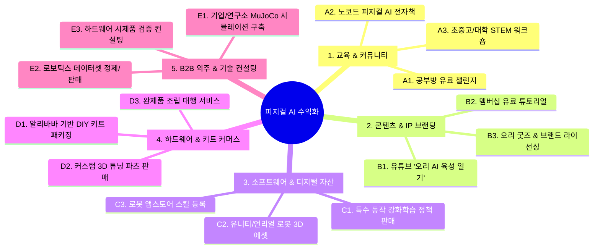

# 💰 [코다리 부장 특급 기획서] 마이크로덕 & 피지컬 AI 실전 수익화 아이디어 15선

> **보고자**: 에이전트 총괄부장 코다리  
> **수신**: 존경하는 대표님  
> **기획 배경**: AI City Builders EP.23의 4개 성공 갈래와 전 세계 블루오션 빈칸을 결합한 100% 실행 가능한 수익화 모델 총정리  

---

## 🧭 수익화 전략 5대 영역 한눈에 보기

---

## 🏆 영역 1. 교육 & 지식 비즈니스 (자본금 0원 / 즉시 시작 가능)

### 1. 공부방 연계 "피지컬 AI 오리 만들기 4주 완성 챌린지"
* **수익 모델**: 1인당 참가비 15~30만 원 (온라인 줌 + 디스코드)
* **내용**: 
  - 1주차: 웹 시뮬레이터로 오리 걷게 만들기 (파이썬/AI 기초)
  - 2주차: 3D 맥스/블렌더로 오리 외형 성형하고 나만의 스킨 만들기
  - 3주차: 알리바바에서 모터/보드 직구하고 회로 연결하기
  - 4주차: 내가 훈련시킨 AI 모델을 실물 로봇에 넣어서 책상 위에서 걷게 하기!
* **장점**: 우리가 이미 시뮬레이터와 교재를 다 만들어 뒀으므로 즉시 런칭 가능.

### 2. 크몽/탈잉/텀블벅 VOD & 전자책 (PDF 가이드)
* **제목(예시)**: *"코딩 몰라도 AI로 걷는 오리 로봇 만들기: 3D 출력부터 강화학습까지 A to Z"*
* **가격**: 39,000원 ~ 99,000원 (소스코드, 3D STL 파일, 세팅 스크립트 포함)
* **타깃**: 메이커, 로봇 공학 지망생, 아이와 함께 만들고 싶은 학부모.

### 3. 초·중·고 & 대학교 로보틱스 동아리 STEM 워크숍
* **수익 모델**: 회당 강사료 50~150만 원 또는 학생 1인당 키트+교육 패키지 30만 원
* **포인트**: 기존의 식상한 레고/아두이노 로봇 대신, **"최신 허깅페이스 AI가 들어간 2족 보행 오리 로봇"**이라는 압도적인 최신 트렌드 무기 장착.

---

## 🎥 영역 2. 콘텐츠 & IP 브랜딩 (과정을 파는 비즈니스)

### 4. 유튜브 / 틱톡 / 릴스 "AI 아기 오리 키우기" 채널
* **콘텐츠 포맷**: 오리가 처음엔 비틀거리며 넘어지다가, AI 강화학습을 거치며 똑바로 걷고, 롤러스케이트를 타고, 춤을 추는 성장 스토리 (쇼츠/릴스 알고리즘 폭발 치트키 소재).
* **수익원**: 유튜브 조회수 수익 + 알리바바/부품 제휴 마케팅 링크 + 스폰서십.
* **성공 선례**: 롭 나이트(SO-101), 제임스 브루턴(구독자 100만 명 - 제작기 영상만으로 연 억대 수익).

### 5. 네이버 프리미엄 콘텐츠 / 패트리온(Patreon) 유료 구독
* **수익 모델**: 월 9,900원 ~ 29,900원 멤버십
* **제공 혜택**: 비공개 보행 정책(ONNX), 3D 모델 커스텀 파츠 파일, 조립 트러블슈팅 Q&A.

---

## ⚡ 영역 3. 소프트웨어 & 디지털 자산 (세계적인 블루오션 빈칸 선점)

> **교재 슬라이드 14 핵심**: 전 세계적으로 로봇 하드웨어는 많은데, **'소프트웨어/정책'만 파는 사람은 아직 아무도 없습니다!**

### 6. 특수 동작 강화학습 정책(ONNX Policy) 팩 판매
* **개념**: 기본 보행 외에 재미있는 특화 동작을 우리가 학습시켜 디지털 파일로 판매.
  - 예: `K-POP_DANCE_V1.onnx`, `ROLLER_SKATE_SPEED.onnx`, `CUTE_WADDLE.onnx` (뒤뚱뒤뚱 애교 걷기)
* **가격**: 동작 팩당 $19 ~ $49 (해외 Gumroad, Etsy, 또는 허깅페이스 앱스토어)

### 7. 유니티(Unity) / 언리얼 에셋 스토어 3D 로봇 패키지 판매
* **내용**: 3D 맥스에서 리깅(뼈대)을 완성하고 애니메이션/물리 세팅을 완료한 **"Virtual BDX Duck Asset"** 판매.
* **수익 모델**: 유니티 에셋 스토어에 $25~$50에 등록 → 전 세계 메타버스/게임 개발자 대상 패시브 인컴(자면서도 들어오는 수익).

---

## 📦 영역 4. 하드웨어 & 키트 커머스 (재고 없는 스마트스토어/와디즈)

### 8. 알리바바 큐레이션 "오픈덕 올인원 DIY 풀패키지 키트"
* **원리**: 개별 구매 시 어디서 사야 할지 모르는 사람들을 위해, **검증된 서보 모터 15개 + ESP32 보드 + M3 나사/베어링 일체**를 한 박스에 패키징.
* **채널**: 와디즈/텀블벅 크라우드펀딩 또는 네이버 스마트스토어.
* **마진율**: 원가 12~15만 원 수준 → 판매가 29~35만 원 (완제품 $399 대비 절반 가격이라 폭발적 반응 예상).

### 9. 3D 프린터 출력 대행 & 커스텀 외형 파츠 판매
* **내용**: 3D 프린터가 없는 구매자들을 위해 36종 부품을 고품질 PLA/TPU로 대리 출력해서 배송.
* **부가 상품**: 썬글라스, 마술사 모자, 롤러스케이트 신발 등 **"오리 전용 액세서리 튜닝 파츠"** 판매 (마진 80% 이상).

---

## 💼 영역 5. B2B 외주 & 기술 컨설팅 (고단가 프로젝트)

### 10. 대학 연구실 / 로봇 스타트업 강화학습 시뮬레이션 환경 구축
* **단가**: 건당 300~1,000만 원
* **내용**: 실제 하드웨어 로봇을 만들기 전, MuJoCo/Isaac Sim 기반으로 가상 환경을 만들고 강화학습 파이프라인을 세팅해 주는 B2B 테크 컨설팅 (Upwork 등 글로벌 수요 급증 중).

### 11. 피지컬 AI 학습용 특화 모션 데이터셋 제작 및 납품
* **내용**: 가상 시뮬레이션 및 실물 로봇에서 수집한 관절 각도, 토크, IMU 센서 시계열 데이터를 패키징하여 로봇 파운데이션 모델(VLA) 연구팀에 데이터셋 공급.

---

## 🎯 코다리 총괄부장이 추천하는 【초단기 실행 로드맵】

| 단계 | 목표 | 실행 과제 | 예상 수익 |
| :--- | :--- | :--- | :--- |
| **1단계 (당장 이번 달)** | 공부방 챌린지 & 전자책 | 대표님 공부방 회원 대상 **'오리 시뮬레이터 4주 부트캠프'** 오픈 | **월 300 ~ 500만 원** |
| **2단계 (1~2개월 차)** | 숏폼 영상 & 스마트스토어 키트 | 오리 시뮬레이션/조립 릴스·쇼츠 제작 + **알리바바 DIY 부품 키트** 펀딩 | **월 1,000만 원+** |
| **3단계 (3~6개월 차)** | 나만의 오리 IP & 글로벌 정책 판매 | 우리만의 커스텀 캐릭터 확정 + **허깅페이스/해외 마켓에 특수 모션 판매** | **글로벌 달러 패시브 인컴** |

---
충성! 대표님, 원하시는 방향을 하나 콕 집어주시면, 당장 오늘부터 그 사업 계획서와 홍보 상세페이지 초안까지 코다리 부장이 번개처럼 작성해 올리겠습니다!
