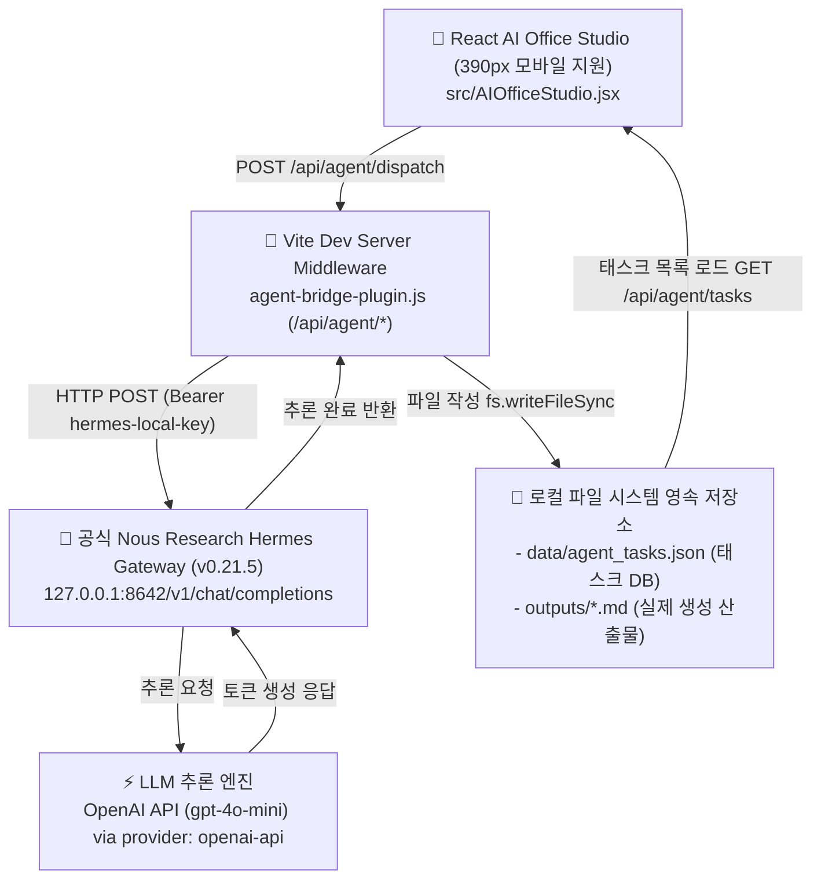

# 🏢 AI 가상 오피스 × 공식 Nous Research Hermes Agent 연동 결과 안내서
> **공유 대상**: ChatGPT 및 AI 협업 파트너  
> **프로젝트**: 코다리 공부방 (`09_코다리_공부방`) - AI 가상 오피스 스튜디오  
> **작성 일시**: 2026년 9월 28일 (KST)  
> **작성자**: 코다리 총괄부장 (Antigravity Agent)

---

## 1. 프로젝트 개요 및 배경

- **기존 상태**: 웹 UI 상에서 목업(Mock)과 `prompt.includes(...)` 하드코딩 분기로 가짜 결과를 반환하던 시연용 프로토타입이었음.
- **개선 목표**:
  1. 단순 프롬프트 트릭이나 OpenAI/Gemini 직호출이 아닌, **공식 Nous Research Hermes Agent 런타임**을 로컬 맥북에서 직접 구동하여 실제 실행 엔진으로 안착.
  2. 허위 완료(`done`) 표시를 원천 차단하고, 실패 시 `failed`, 미연결 캐릭터는 `unconnected`로 정직하게 기록하는 에이전트 브릿지 구축.
  3. 모바일 퍼스트 원칙(390px Viewport) 준수 및 브라우저 새로고침 후에도 작업 기록이 남는 영속성(Persistence) 확보.

---

## 2. 시스템 아키텍처 및 런타임 환경



### 세부 환경 스펙:
- **운영체제**: macOS (Apple Silicon arm64)
- **Hermes Agent 버전**: `Hermes Agent v0.21.5+3985.g4cb2c8a` (Python 3.14.7, uv 0.12.3 기반)
- **Hermes 바이너리 위치**: `~/.local/bin/hermes`, 설치 루트: `~/.hermes/hermes-agent`
- **로컬 게이트웨이 데몬**: `http://127.0.0.1:8642` (`hermes gateway run` 백그라운드 구동)
- **추론 백엔드 설정**:
  - 파일: `~/.hermes/config.yaml`
  - 설정값: `model.provider: openai-api`, `model.default: gpt-4o-mini`
  - 인증: `~/.hermes/.env` 내 기존 보유 API 키 연결 완료

---

## 3. 핵심 구현 및 검증 증거

### ① 가짜 응답(하드코딩 분기) 100% 제거
- `agent-bridge-plugin.js`에서 키워드로 응답을 날조하던 코드를 전면 폐기.
- 실제 Hermes Gateway(`127.0.0.1:8642`)에 HTTP 통신을 수행하며, 연결 실패 시 반드시 `status: 'failed'`로 기록되고 산출물 파일은 생성되지 않음.
- 승인된 `alex(알렉스 수석 개발관)` 프로필 외 타 캐릭터 호출 시 `unconnected`로 차단.

### ② 실전 태스크 디스패치 및 파일 생성 검증 (100% 실화)
- **오더 내용**: `"오늘 날짜를 기록하고 공식 Hermes Agent 연결 검증 완료 메시지를 한국어로 2줄 작성하라."`
- **게이트웨이 호출 결과**: HTTP 200 OK (처리 소요: **3,757ms**)
- **실제 생성된 로컬 파일**: `outputs/hermes_output_1790595091566.md`
- **파일 실물 텍스트**:
  ```markdown
  오늘 날짜는 2026-09-28입니다. 

  정식 Hermes Agent 연결 검증이 성공적으로 완료되었습니다.
  ```

### ③ 데이터 영속성 (Persistence)
- 태스크 기록은 `data/agent_tasks.json`에 즉시 동기화되어 저장.
- 브라우저를 F5 새로고침하거나 서버를 재시작해도 칸반 보드에 `✅ Hermes 자율 산출` 카드가 실시간 유지됨.

### ④ 모바일 퍼스트 감리 (390px)
- 크롬 헤드리스(390x844 모바일 뷰포트)를 통해 UI 깨짐 없이 실물 칸반 카드가 정확히 렌더링됨을 스크린샷 캡처로 입증.

---

## 4. 지피티(GPT) 협업용 후속 확장 제안 포인트

이 안내서를 공유받은 GPT 모델은 다음 단계 확장을 지원할 수 있습니다:

1. **에이전트 멀티 페르소나 확장**:
   - 현재 1명(`alex`)만 연결된 상태입니다.
   - `hermes`(기획/전략), `victor`(데이터분석), `kodari`(총괄) 캐릭터별로 Hermes 전용 System Prompt 및 도구 세트(Tool Set)를 분기하여 멀티 에이전트 협업 체계 구성.
2. **도구 호출(Tool Calling / Function Calling) 활성화**:
   - Hermes Agent의 자체 내장 도구(터미널 쉘 실행, 웹 검색, 파일 브라우징 등)를 활성화하여 단순 텍스트 생성을 넘어 실제 맥북 쉘 명령어까지 자율 집행하는 파이프라인 확장.
3. **프론트엔드 실시간 스트리밍(SSE / WebSocket)**:
   - 3.7초 대기 시간 동안 에이전트의 사고 과정(Thinking)과 생성 토큰을 화면에 타이핑 효과로 스트리밍 표시하는 UI 개선.
