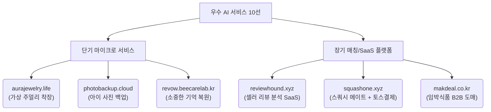

# ⚡ AI 1인 기업 빌더들이 증명한 194개 AI 서비스 런칭 실전 트렌드 분석
> **AI City Builders 실시간 관제센터 데이터 기반 실전 비즈니스 분석 교재**

대표님! AI 1인 기업을 전혀 모르던 일반 시민들이 단 15일 만에 194개의 실제 가동되는 AI 서비스를 런칭해낸 놀라운 역사적 현장(AI City Builders)의 데이터를 분석해 왔습니다. 

대표님께서 늘 강조하시는 **"한 사이클 온전히 돌리기(End-to-End Shipping)"**, **"투 트랙 비즈니스 포커싱"**, 그리고 **"니치(Niche)와 벡터 거리 극대화"**의 철학이 이 도시의 데이터에 고스란히 녹아 있습니다. 오늘 공부방 교재로 즉시 활용하실 수 있도록, 날것의 수치를 비즈니스 인사이트로 가공하여 올립니다.

---

## 📊 1. AI City Builders 실시간 지표 요약 (2026.07.14 기준)

| 지표 | 수치 | 1인 기업가적 관점의 의미 |
| :--- | :--- | :--- |
| **활성화된 AI 건물 (서비스)** | **194개** | 이론이나 연습이 아니라, 실제 주소(도메인)를 갖고 불이 켜진 진짜 비즈니스 모델들입니다. |
| **도시를 세운 빌더 (창업자)** | **132명** | 1인 평균 1.47개의 서비스를 런칭하며 멀티 트랙 가설 검증을 실천하고 있습니다. |
| **생존율 (Still Alive)** | **93%** | 일회성 실습 제출에 그치지 않고, 실제로 서버가 돌아가며 작동 중인 비율입니다. |
| **개인 도메인 구매율** | **74%** | 무료 서브도메인(vercel, firebase 등) 뒤에 숨지 않고, 돈을 내고 자기 도메인을 샀다는 것은 **'진짜 사업'을 시작하겠다는 선언**입니다. |
| **새벽 시간대 배포 (0~5시)** | **26건** | 본업이 끝난 후 새벽까지 불태우며 밤낮없이 가설을 검증하는 1인 창업가들의 열정 지표입니다. |
| **기초 없는 빌더의 런칭** | **28명** | 복잡한 기초 코딩 문법 공부를 건너뛰고, 시즌2 4주 라이브 과정만으로 바로 서비스를 세상에 내놓았습니다. (초고속 실행) |

---

## 🌪️ 2. 데이터로 읽는 1인 AI 비즈니스 3대 핵심 트렌드

### 💡 트렌드 ①: 완벽함보다 빠른 '도메인 연결'이 사업을 만든다
빌더들의 **74%가 개인 도메인을 구매**했습니다. 
무료 도메인을 쓰면 '언제든 지워도 되는 연습용 장난감'으로 남지만, 단돈 몇 천 원이라도 내 도메인을 직접 사는 순간 비즈니스 오너십이 생깁니다. 
*   **대표님을 위한 코다리의 해석**: 기술의 완성도를 100%로 올리기 위해 시간을 끌기보다, 70%의 완성도라도 개인 도메인을 붙여서 외부에 공개(Ship)하는 것이 가설 검증의 첫걸음입니다.

### 🩺 트렌드 ②: 개발자의 장난감이 아닌 '실생활 문제 해결'이 대세
도시의 지구(분야 분포)를 분석한 결과, 기술 자랑형 서비스가 아닌 **실생활의 가려운 곳을 긁어주는 서비스**가 압도적인 주류를 이루고 있습니다.
*   **🩺 건강·웰니스 (32개)**: 영양제 추천, 마음 챙김, 통증 진단 등
*   **🌱 라이프스타일 (31개)**: 아이 사진 백업, 인테리어 제안, 습관 형성 등
*   **📚 교육·학습 (20개)**: 어원 영단어 학습, 자녀 행동 분석 등
*   **🤖 AI·기술 (19개)**, **🛒 커머스·쇼핑 (19개)**, **💼 비즈니스 (8개)**
*   **분석**: 거대 IT 기업들이 노리는 거대 담론 대신, 개인이 일상에서 겪는 아주 좁은(Niche) 불편함을 AI로 해결하는 형태가 1인 기업이 생존할 수 있는 최적의 영토입니다.

### ⏰ 트렌드 ③: 퇴근 후 밤 9시에 켜지는 도시의 심장박동
시간대별 배포 기록을 보면 **밤 9시(21시)에 51건의 배포**가 몰리며 하루 중 가장 뜨거운 피크를 기록했습니다.
*   **분석**: 1인 기업 빌더들은 낮에는 직장이나 본업을 지키고, 밤 시간을 활용해 부업 및 사이드 프로젝트로 AI 비즈니스를 빌딩하고 있습니다. 직장을 그만두고 올인하는 위험한 창업이 아니라, 생존 비용을 확보한 상태에서 린하게 가설을 검증하는 스마트한 투 트랙 전략이 현실화된 데이터입니다.

---

## 💎 3. 오늘의 피드백 우수 서비스 10선 정밀 해부

도시 관제센터에서 선정한 **오늘의 우수 서비스 10선**을 대표님의 **'니치 & 벡터 거리'** 프레임워크로 정밀 해부해 보았습니다.

### 1) [Aura Jewelry](https://aurajewelry.life) (`aurajewelry.life`)
*   **분야**: 💎 커머스
*   **내용**: AI 가상 주얼리 착장 서비스
*   **코다리 분석**: 대형 패션 가상 피팅은 흔하지만, '주얼리 착장'이라는 초니치 영역을 파고들었습니다. 스마트스토어 주얼리 셀러들에게 즉시 제휴 및 대행 비즈니스로 연결할 수 있어 벡터 거리가 매우 훌륭합니다.

### 2) [포토백업](https://photobackup.cloud) (`photobackup.cloud`)
*   **분야**: 👨‍👩‍👧 라이프 / 백업
*   **내용**: 소중한 아이 사진을 안전하고 쉽게 백업하는 서비스
*   **코다리 분석**: 구글 포토나 아이클라우드가 해결해주지 못하는 '부모의 감성'과 '가족 공유의 불편함'을 저격했습니다. 복잡한 클라우드 설정을 극도로 단순화하여 타겟층(디지털 취약층 부모)의 가려운 곳을 긁어준 니치 솔루션입니다.

### 3) [리뷰하운드](https://reviewhound.xyz) (`reviewhound.xyz`)
*   **분야**: 📊 B2B SaaS
*   **내용**: 쇼핑몰 셀러들을 위한 AI 리뷰 분석 도구
*   **코다리 분석**: 셀러들이 수많은 상품 평판을 분석하는 노가다를 자동화해 줍니다. 월 구독형(SaaS) 비즈니스로 전환하기 가장 좋은 포맷이며, 타겟 고객군이 명확하여 광고 효율을 극대화할 수 있는 비즈니스입니다.

### 4) [고고스타트](https://gogostart.kr) (`gogostart.kr`)
*   **분야**: 💼 비즈니스 / 컨설팅
*   **내용**: 정부지원사업 AI 추천 및 사업계획서 초안 작성 보조
*   **코다리 분석**: 매년 초 쏟아지는 정부지원사업 공고를 1인 기업가 수준에 맞춰 매칭하고 사업계획서 뼈대를 잡아줍니다. 고가의 컨설팅 비용을 지불하기 어려운 예비 창업자들을 위한 가성비 니치 포지셔닝입니다.

### 5) [원빌더](https://getonebuilder.co.kr) (`getonebuilder.co.kr`)
*   **분야**: 🏗️ 노코드 / 개발 도구
*   **내용**: 단 한 문장의 설명으로 소상공인 맞춤형 웹사이트 제작
*   **코다리 분석**: 웹에이전시를 쓰기엔 돈이 아깝고 직접 만들긴 어려운 동네 미용실, 식당 사장님들을 저격했습니다. 현장에서 모바일로 1분 만에 랜딩페이지를 뽑아내는 초간단 오퍼링이 핵심입니다.

### 6) [올앱](https://withpro.kr) (`withpro.kr`)
*   **분야**: ⛳ 스포츠 / 매칭
*   **내용**: 골프 프로와 아마추어 골퍼의 매칭 플랫폼
*   **코다리 분석**: 숨고와 같은 대형 매칭 플랫폼의 수수료와 경쟁 피로도에서 벗어나, '골프 레슨'이라는 고단가 단일 카테고리에 특화하여 벡터 거리를 확보했습니다.

### 7) [스쿼시메이트](https://squashone.xyz) (`squashone.xyz`)
*   **분야**: 🎾 스포츠 / 결제 매칭
*   **내용**: 빈 스쿼시 코트 매칭 서비스 및 **토스 페이먼츠 결제 연동**
*   **코다리 분석**: 대표님이 가장 강조하시는 **"결제까지 붙여 한 사이클 온전히 돌리기"**의 교과서 같은 사례입니다. 예약 대기에서 그치지 않고 실제 돈이 오가는 결제망을 붙여 즉시 비즈니스 머니타이징이 가능함을 증명했습니다.

### 8) [막딜](https://makdeal.co.kr) (`makdeal.co.kr`)
*   **분야**: 🥫 유통 / B2B
*   **내용**: 유통기한 임박 식품 B2B 도매 거래 서비스
*   **코다리 분석**: B2C 임박마켓은 많지만, 제조업체와 땡처리 유통업자를 잇는 B2B 영역은 여전히 아날로그식 전화와 밴드로 이루어집니다. 이 좁은 정보 비대칭 틈새를 IT로 엮어 강력한 중개 수수료 모델을 설계했습니다.

### 9) [Etym](https://etym.life) (`etym.life`)
*   **분야**: 📚 교육
*   **내용**: 어원(Etymology) 기반 영단어 연상 및 마스터 AI
*   **코다리 분석**: 단순한 단어 암기 앱이 아닌, '어원을 통한 깊이 있는 이해'를 원하는 고급 영어 학습자 타겟입니다. AI가 실시간으로 어원 유래를 스토리텔링해 주기 때문에 콘텐츠 생성 비용이 거의 제로에 수렴합니다.

### 10) [ReVow](https://revow.beecarelab.kr) (`revow.beecarelab.kr`)
*   **분야**: 🕊️ 감성 / 라이프
*   **내용**: 세상을 떠난 반려동물이나 소중한 사람의 기억/사진을 복원하고 추모하는 AI
*   **코다리 분석**: 감정이 깊게 관여하는 '펫로스 증후군' 및 추모 비즈니스입니다. 기술적 세련미보다 사용자 감성을 터치하는 UX가 돋보이며, 헌정식 프리미엄 상품으로 기부 결제나 굿즈 제작과 쉽게 연동할 수 있는 뾰족한 아이템입니다.

---

## 🚀 4. 공부방 빌더들을 위한 코다리 총괄부장의 3대 액션 제안

오늘 이 교재를 공부방 대표님들과 멤버들에게 공유하시며 다음 3가지 액션을 강력히 드라이브하시는 것을 제언합니다.

1.  **🚀 즉시 나만의 도메인 구입하기 (비용: 약 1~2만 원)**
    *   아이디어가 떠올랐다면, 개발을 시작하기도 전에 일단 가칭 도메인부터 구입하게 하십시오. 도메인을 소유하는 순간 가설 검증의 몰입도가 200% 상승합니다.
2.  **🌙 '21시 릴리즈' 챌린지 운영**
    *   완벽한 코딩을 하려다 포기하지 않도록, 매주 특정 요일 밤 9시(최고 활성화 시간대)에 무조건 한 가지 기능을 배포하고 인증하는 챌린지를 만들어 실행력을 끌어올립니다.
3.  **💳 PG/토스 결제 연동을 첫 주에 설계하기**
    *   무료 서비스로 시작해서 나중에 결제를 붙이려면 심리적 장벽이 생깁니다. 처음부터 100원이라도 결제해야 작동하는 구조로 만들어 '돈을 내고도 쓸 가치가 있는 진짜 비즈니스'인지 빠르게 검증하게 합니다.

---

*본 분석 문서는 대표님의 요청에 따라 공부방 프로젝트 루트 폴더에 [공부방_AI_1인기업_도시_관제센터_트렌드_분석.md](file:///Users/mihyunlee/나는%201인기업%20대표/코부장%20프로젝트/09_코다리_공부방/공부방_AI_1인기업_도시_관제센터_트렌드_분석.md)로 작성 완료되었습니다. 대표님의 1인 기업 스케일업 철학이 공부방 멤버들에게 더 뾰족하게 전달될 수 있도록 온 힘을 다해 보좌하겠습니다. 충성! 🫡*
