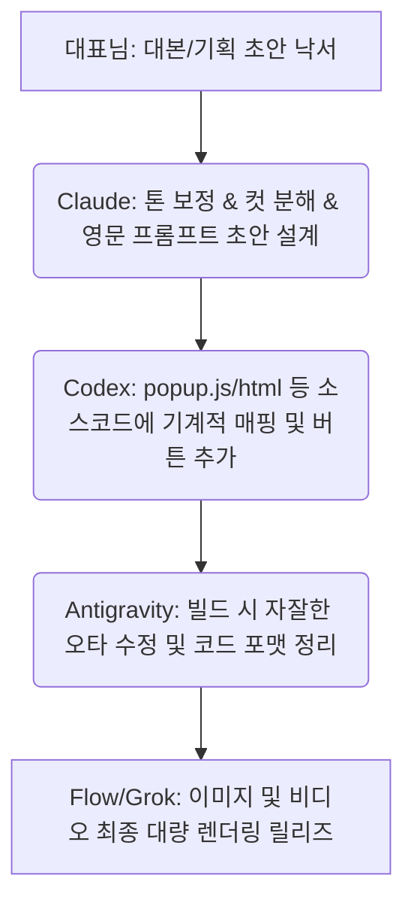

# 🎯 [공부방 가이드] 1인 창업가용 AI 분업 워크플로우 (2026-04 기준)
> **안정도·비용·속도를 기준으로 한 작업별 최적 AI 배정 및 생산성 극대화 매뉴얼**

---

## 📊 현재 보유 AI 5종 포지셔닝 비교

| AI 엔진 | 강점 | 약점 | 비용 리스크 | 종합 안정도 |
|----|------|------|------|--------|
| **Claude (클로드 코드)** | 창작, 비즈니스 전략, 심층 아키텍처 설계 | 크레딧 소모 속도 빠름 | 💰💰 (높음) | **⭐ 별 5개 (최고)** |
| **Codex (OpenAI)** | 대용량 소스코드 기계적 변환, 리팩토링 | 창의적 기획력 부족 | 💰💰 (보통) | **⭐ 별 4개 (우수)** |
| **Antigravity Agent** | IDE 로컬 파일 제어, 신속한 파일 조작 | 가끔 설레발, 뇌정지, 사과 반복 | 💰 (낮음) | **⭐ 별 2개 (보완 요망)** |
| **Local Ollama** | 완전 무료 구동, 완벽한 오프라인 프라이버시 | 로컬 하드웨어(16GB 램) 성능 한계 | 🆓 (무료) | **⭐ 별 3개 (양호)** |
| **Gemini (Antigravity 내)** | 초고속 텍스트 임베딩, 무상 API 혜택 | 생성 퀄리티 편차 존재 | 🆓 (무료) | **⭐ 별 3개 (양호)** |

---

## 🎨 작업 카테고리별 AI 비서 배정 원칙

### 🧠 1. 복잡한 추론 및 기획 ➔ **Claude 전담**
* **주요 태스크**: 비즈니스 타겟 포지셔닝 설계, 광고 대본/카피라이팅 창작, 코드 버그 원인 분석, 문체 변환.
* **💡 운영 팁**: 크레딧 비용이 비싸므로 질문은 항상 명확하고 뾰족하게 가다듬어 한 번에 쏘고, 단순 코딩이나 반복 노가다 작업은 Claude에게 시키지 마십시오!

### ⚙️ 2. 기계적인 대량의 코드 작업 ➔ **Codex 전담**
* **주요 태스크**: 수십 개 프롬프트 자동 조립 템플릿 제작, JSON 데이터에서 리액트 컴포넌트 자동 빌드, 대량의 단위 테스트 케이스 생성.
* **💡 운영 팁**: **[Claude가 기획/설계하고 ➔ Codex가 구현/수행]** 하는 것이 1인 기업이 시간을 아끼는 가장 핵심적인 분업 공식입니다.

### 📝 3. 단순 코드 오타 수정 및 주석 ➔ **Antigravity 전담**
* **주요 태스크**: 소스코드 오타 수정, 변수명 일괄 변환, 코드 포맷팅 정렬, 한글 주석 추가.
* **🚫 경고**: 복잡한 비즈니스 로직 수정이나 리팩토링을 Antigravity에게 혼자 시키면 설레발로 오히려 코드를 망칠 수 있으니 철저히 가벼운 심부름 업무에만 국한시키십시오!

### ⚡ 4. 무료 일상 자동화 & 프라이버시 ➔ **Local Ollama 전담**
* **주요 태스크**: 클립보드 복사 글 실시간 요약, 한영 문서 초고속 번역, 일일 Obsidian 노트 내용 마크다운 정리.
* **💡 운영 팁**: 대표님의 Mac 내부 메모리로만 작동하므로 요금이 **0원**입니다. 네트워크 유출 우려가 있는 프라이빗 문서 요약 시 필수적으로 사용하십시오.
```bash
pbpaste | ollama run qwen3:4b "이 텍스트 요약해줘"
```

### 🔤 지식 문서 RAG 및 임베딩 ➔ **Gemini 전담**
* **주요 태스크**: 옵시디언 노트 데이터의 실시간 벡터화 및 공부방 서재 내 유사 키워드 RAG 데이터 연동.

---

## 🔄 1인 기업 실전 AI 협업 가동 시나리오



공부방 지식 서재에 수록 완료했습니다. 대표님, 이 5대 엔진의 톱니바퀴 분업 구조를 통해 언제나 최강의 시간 대비 가성비를 쥐고 가십시오! 충성!  
*(보관 파일: [공부방_가이드_AI_분업_워크플로우.md](file:///Users/mihyunlee/나는 1인기업 대표/코부장 프로젝트/09_코다리_공부방/공부방_가이드_AI_분업_워크플로우.md))*
