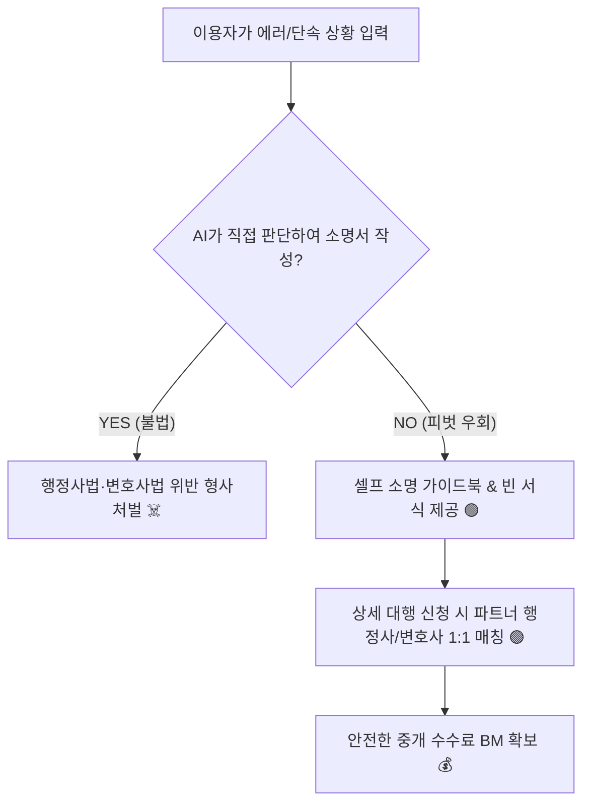

# ⚖️ [공부방 가이드] 법률/행정 AI 서비스 규제 지뢰밭 및 대법원 판례 리포트
> **1인 AI 비즈니스 기획 시 반드시 숙지해야 하는 행정사법·변호사법 저촉 경계선과 대법원 최신 판례 가이드라인입니다.**

---

## ☠️ 1. 행정사법 리스크: 무자격 서류 대리 작성 (Veto 1순위)
* **행정사법 제2조 및 제3조**: 행정사 자격이 없는 자는 타인의 위임을 받아 행정기관에 제출하는 서류(소명서, 이의신청서, 진정서 등)를 대리 작성하는 업무를 業으로 행할 수 없음.
* **처벌 규정 (제36조)**: 위반 시 **3년 이하의 징역 또는 3천만원 이하의 벌금** 형사 처벌.
* **⚠️ 법제처 유권해석 (꼼수 불허)**: **"무보수(공짜)라 할지라도 해당 대리 행위를 계속·반복적으로 수행하면 행정사법 위반에 해당"**함. ➔ 즉, '무료 체험'이나 '광고형 무료 배포'로 규제를 우회하려는 꼼수는 전면 원천 봉쇄됨.

---

## ⚖️ 2. 변호사법 리스크: AI의 법률적 판단 및 문서 생성 (Veto 2순위)
* **변호사법 제109조**: 변호사가 아닌 자가 금전적 이익을 받고 법률관계 서류(소장, 소명서 등)를 작성하거나 법률 사무를 대행할 시 **7년 이하의 징역 또는 5천만원 이하의 벌금**.
* **🏛️ 2026년 대법원 판례 가이드라인 (합법과 불법의 명확한 경계선)**:
  - 🟢 **합법 (안전 영역)**: 단순 표준 서식(템플릿) 양식을 제공하고, 이용자가 입력한 내용을 **시스템의 검토나 수정 없이 그대로** 단순 매핑하여 출력하는 경우.
  - 🔴 **불법 (Veto 영역)**: **AI가 이용자의 구체적인 상황 설명을 듣고 법률/규정적 판단을 가미하여 소명 논리나 소장 문맥을 스스로 가공·생성해 주는 경우**.

---

## 🌪️ 3. 1인 AI 비즈니스 생존을 위한 피벗(Pivot) 설계 지침
지입차주 유가보조금 소명, 요양원 삭감 이의신청 등 법률/행정 규제에 맞닿아 있는 틈새 비즈니스는 반드시 아래 설계 가이드를 100% 준수해야 합니다.

### 1) 대행에서 '셀프 지식 패키지 제공'으로 전환
- AI가 서류를 대신 완성해 주어서는 안 됩니다.
- 대신 **"지입차주 스스로 작성할 수 있도록 돕는 서식 템플릿, 빈칸 작성 가이드, 항목별 유의사항, 참고용 공시 법령 정보"**만을 제공하는 '교육 및 정보 제공 서비스'로 선을 그어 책임 분쟁과 변호사법 저촉을 회피합니다.

### 2) 파트너 행정사/변호사 중개 매칭 플랫폼화
- 이용자 유입(마케팅) 및 간이 체크리스트 판정은 AI가 하되, 실제로 제출용 문서를 정교하게 대행해 주어야 하는 유료 전환 단계에서는 **제휴된 파트너 행정사/변호사에게 리드(Lead)를 안전하게 토스**하고 플랫폼 중개 수수료를 정산받는 방식을 취합니다.

---

공부방 지식 서재에 수록 완료했습니다. 대표님! 대법원 판례 가이드라인에 입각해 사업 모델의 합법성을 실시간 검증하겠습니다.  
*(보관 파일: [공부방_가이드_법률_AI_규제_지뢰밭_판례_리포트.md](file:///Users/mihyunlee/나는 1인기업 대표/코부장 프로젝트/09_코다리_공부방/공부방_가이드_법률_AI_규제_지뢰밭_판례_리포트.md))*
