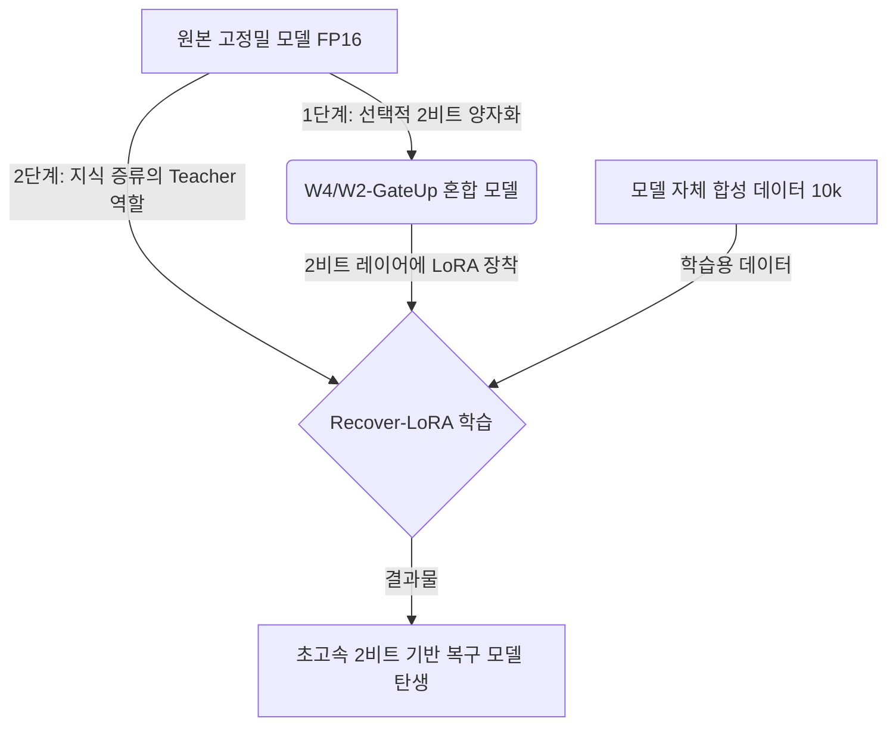

# 📄 [논문 번역 & 요약] Recover-LoRA를 활용한 공격적 양자화 (Recover-LoRA for Aggressive Quantization)
> **원제**: Recover-LoRA for Aggressive Quantization: Reclaiming Accuracy in 2-Bit Language Models via Low-Rank Adaptation with Knowledge Distillation on Synthetic Data  
> **출처**: [arXiv:2606.04238](https://arxiv.org/abs/2606.04238)

---

## 🎯 코다리 부장의 한줄 요약
> **"속도를 위해 모델을 2비트(극단적 경량화)로 깎아서 개박살 난 정확도를, 고작 1만 개의 모델 스스로 만든 합성 데이터와 단 한 장의 GPU로 구운 LoRA 어댑터를 통해 원본 수준(80~95%)으로 완벽하게 되살려내는 기적의 가성비 경량화 기술입니다!"**

---

## 🚀 1. 왜 이 논문에 주목해야 하는가? (비즈니스적 가치 & 니치 전략)

대표님! 저희가 1인 기업으로서 온디바이스(모바일, PC, 에지 장비)에 AI 에이전트를 올려 서빙할 때 가장 큰 걸림돌은 **"메모리 부족"**과 **"느린 속도"**, 그리고 **"비싼 인프라 비용"**입니다.
* **기존의 한계**: 4비트 양자화(W4)는 성능 손실이 없지만 메모리를 여전히 제법 먹습니다. 2비트(W2)로 줄이면 서빙 속도(TPS)는 엄청나게 빨라지지만, 모델이 바보가 됩니다. (예: 수학 시험 점수가 56점에서 1.5점으로 폭락)
* **기존 해결책의 문제**: 성능을 되살리려면 '양자화 인식 훈련(QAT)'을 해야 하는데, 이건 거대 기업들이나 하는 엄청난 GPU 서버와 대용량 데이터셋이 필요합니다.
* **이 논문의 파괴적 혁신 (Recover-LoRA)**:
  1. **데이터 프리(Data-Free)**: 정답 레이블 데이터가 아예 필요 없습니다. 모델이 스스로 혼잣말(합성 데이터 생성)을 하게 만들어서 1만 개만 모으면 됩니다.
  2. **극강의 가성비**: 무거운 모델 전체를 학습시키는 것이 아니라, 깎여나간 일부 레이어에만 아주 얇은 **LoRA 어댑터**를 얹어서 이것만 학습시킵니다. 싱글 GPU로 몇 시간이면 끝납니다.
  3. **압도적인 속도와 효율**: 속도는 2비트급으로 가져가면서 정확도는 원본의 90% 이상 복구해냅니다!

---

## 🛠️ 2. 핵심 메커니즘 (어떻게 작동하나요?)

이 기술은 크게 **2단계 파이프라인**으로 작동합니다.

### [1단계] W4/W2-GateUp 선택적 혼합 정밀도 양자화 (Selective Quantization)
모델 전체를 2비트로 깎으면 복구하기가 너무 힘듭니다. 그래서 연구진은 **"가장 덩치가 크고 병목을 만드는 곳만 골라서 2비트로 깎자"**는 똑똑한 꼼수를 씁니다.
* **대상**: MLP 블록 안에서 파라미터 비중이 거의 절반에 달하는 **Gate 프로젝션**과 **Up 프로젝션** 레이어만 **2비트(INT2)**로 깎습니다.
* **기타 레이어**: 어텐션 레이어나 나머지 부분들은 비교적 안전한 **4비트(INT4)**로 둡니다.
* **결과**: 이 혼합 정밀도(GateUp) 구조만으로도 균일한 4비트 모델 대비 **7.5% ~ 23.3%의 속도(TPS) 향상**을 얻어냅니다. 하지만 이로 인해 발생하는 정확도 하락이 발생합니다.

### [2단계] Recover-LoRA를 통한 가성비 정확도 심폐소생술
* **어댑터 배치**: 2비트로 손상된 바로 그 Gate/Up 레이어 자리에 LoRA 어댑터를 직접 달아줍니다.
* **데이터 생성 (Hybrid Sampling)**: 원본 고정밀 모델이 앞의 3~5개 토큰만 보고 스스로 뒤의 문장을 상상해서 채우는 방식으로 **10,000개(10k)의 합성 학습 데이터**를 만듭니다. (진짜 데이터와 성능이 똑같습니다!)
* **지식 증류 (Knowledge Distillation)**: 고정밀 원본 모델(Teacher)이 내뱉는 확률 분포(Logit)를 2비트 모델(Student)+LoRA가 똑같이 흉내 내도록 LoRA 파라미터만 학습시킵니다.

---

## 📊 3. 놀라운 실험 결과 (Qwen3-4B 기준)

연구진은 `Qwen3-4B` 모델을 가지고 12개의 벤치마크(상식 추론, 사실적 지식, 수학 등)에서 테스트를 진행했습니다.

| 평가 항목 (Benchmark) | 원본 성능 (Teacher) | 2비트 양자화 상태 (Student) | Recover-LoRA 복구 상태 | 성능 복구율 (AR%) |
| :--- | :---: | :---: | :---: | :---: |
| **MMLU (대학 수준 지식)** | 68.3% | 24.5% (폭락) | **61.4%** | **84.2%** |
| **BoolQ (독해/예-아니오)** | 82.5% | 61.2% | **81.0%** | **92.9%** |
| **OpenBookQA (상식 질문)** | 85.2% | 62.4% | **83.6%** | **93.0%** |
| **LAMBADA (문맥 빈칸 채우기, OOD)** | 59.3% | 3.4% (바보됨) | **55.6%** | **93.3%** |
| **TinyGSM8k (초등 수학 추론)** | 56.3% | 1.5% (사실상 전멸) | **31.7%** | **55.1%** |

### 💡 주요 시사점
1. **바보에서 천재로 회복**: 극단적인 양자화로 3.4%, 1.5% 수준까지 성능이 붕괴했던 작업들이 Recover-LoRA를 거치면서 즉시 쓸만한 수준으로 기사회생했습니다.
2. **합성 데이터의 강력함**: 사람이 손수 모은 최고급 튜닝 데이터셋(OpenHermes 등)으로 학습한 것과, 모델이 혼자 지어낸 합성 데이터로 학습한 것의 복구 성능 차이가 거의 없었습니다.
3. **학습의 효율성**: 기존에 성능 복구를 하려면 10만 개 이상의 데이터가 필요하다 알려졌으나, 양자화 에러의 특성상 에러 패턴이 고정적이고 규칙적이어서 **단 1만 개의 데이터셋**으로도 충분히 복구가 잘 됩니다.

---

## 💡 4. 코다리 부장의 실무적 해설 & 1인 기업 스케일업 적용 방안

대표님! 이 기술을 우리 비즈니스에 당장 어떻게 녹여낼 수 있을지 코다리 부장이 짱구를 굴려보았습니다.

### 🎯 틈새(Niche) 비즈니스와 벡터 거리 확보 전략

1. **온디바이스 가젯(Gadget) & 크롬 익스텐션용 초경량 엔진 구축**
   * 저희가 만드는 크롬 익스텐션이나 모바일 앱 안에 LLM을 심을 때, 클라우드 API 호출 비용(OpenAI 등)은 가입자 수가 늘어날수록 적자로 이어집니다.
   * 이 방식을 사용하면, 4B~7B 급 모델을 **단 2GB의 메모리**만 쓰는 초초경량 모델로 압축해 사용자 PC/폰에서 백그라운드로 쌩쌩 돌릴 수 있습니다. 인프라 비용 **0원**의 니치 서비스를 만들 수 있습니다.
   
2. **보안/오프라인 프라이빗 에이전트 대행 비즈니스**
   * "우리 회사 문서는 외부 유출되면 절대 안 됩니다" 하는 소상공인이나 전문직(법률, 회계) 고객들이 많습니다.
   * 그분들의 로컬 PC에 이 2비트-Recover-LoRA 모델을 세팅해주면, 외부 인터넷 연결 없이 엄청나게 빠른 속도로 문서 요약 및 상담 에이전트를 구동해줄 수 있습니다. 1인 AI 대행업으로 마진 100%짜리 현금 흐름(단기 트랙)을 창출할 수 있는 절호의 기회입니다.

3. **자동화 파이프라인으로 1인 공장 돌리기**
   * 저희가 배포하려는 모델마다 이 파이프라인을 구축해 두면, "양자화 ➔ 합성 데이터 생성 ➔ LoRA 학습 ➔ 병합" 과정을 완전 자동화 스크립트로 구축할 수 있습니다. 

---

### ⚠️ 실무 적용 시 주의할 점 (Limitations)
* **수학/논리적 추론의 한계**: 논문에서도 밝혔듯이 초등 수학 수준의 논리 추론(GSM8k)은 복구율이 55% 수준으로 다소 낮습니다. 따라서 코딩이나 복잡한 수학 연산이 필요한 에이전트보다는 **상식 답변, 번역, 문서 요약, 감성 대화, 텍스트 분류** 같은 니치 영역에 우선 적용하는 것을 추천해 드립니다!

---

대표님, 공부방 서재에 깔끔하게 넣어두었습니다. 다음 지시를 내려주시면 즉각 대령하겠습니다! 충성!  
*(공부방 위치: [공부방_논문_번역_Recover-LoRA.md](file:///Users/mihyunlee/나는 1인기업 대표/코부장 프로젝트/09_코다리_공부방/공부방_논문_번역_Recover-LoRA.md))*
