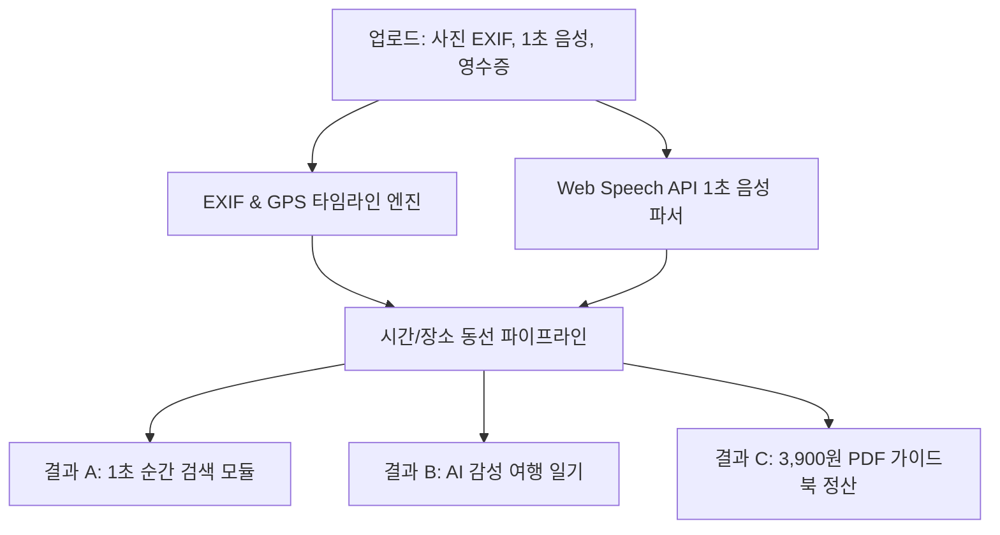

# 🌲 [프로젝트 가이드] TravelTrace AI — 여행로그 & 숏폼 출판 AI 엔진 풀스택 개발 리포트

> **에이전트 총괄부장 코다리 보고**: 대표님이 추진하신 초격차 니치 여행 프로젝트 **'TravelTrace AI'**의 전체 기획, 어도비 딥그린 디자인 시스템, 풀스택 아키텍처, 그리고 3,900원 유료 결제 정산 모델까지 공부방 프로젝트 공식 학습 노트로 완벽 정돈하여 올립니다.

---

## 🎯 1. 1인 기업 스케일업 & 니치(Niche) 전략

- **프로젝트명**: **TravelTrace AI** (여행 기록 ➔ 숏폼 대본 & 감성 전자책 출판 자동화 엔진)
- **니치 타겟팅**: 단순 일기장(경쟁 과열)을 탈피하여 **"여행 사진(EXIF/GPS) + 음성 메모 + 영수증 사진만 올리면 3분 만에 숏폼 대본, 인스타 카드뉴스, PDF 여행 전자책을 동시 발행하는 1인 크리에이터 자동화 툴"**
- **벡터 거리 극대화**: 기록에만 머무는 기존 앱과 차별화 ➔ **수익화/콘텐츠 출판 중심의 3,900원 현금 흐름 파이프라인 결합**

---

## 🎨 2. Adobe Color 공식 럭셔리 디자인 시스템 (Deep Green & Pure White)

| 구분 | 컬러 명칭 | HEX Code | 주요 적용 영역 |
| :--- | :--- | :--- | :--- |
| **Main Background** | Pure Crisp White | `#FFFFFF` | 메인 레이아웃 및 카드 백그라운드 |
| **Deep Green Base** | Deep Forest Green | `#0B3D2E` | 브랜드 로고, 네비게이션 헤더, 메인 텍스트 |
| **Primary Accent** | Rich Emerald Green | `#0F6A4B` | 메인 버튼, 카테고리 뱃지 |
| **Point Accent** | Vibrant Mint | `#1BAA78` | 1초 음성 녹음, 위치 핀 배지 |
| **Luxury Line** | Champagne Gold | `#C9B27C` | 결제 팝업 테두리 및 럭셔리 태그 |

---

## 🛠️ 3. 풀스택 시스템 아키텍처 & 기능 명세



### 핵심 개발 모듈
1. **EXIF Metadata Extractor**:
   - `exifreader` 라이브러리를 통해 사진 속 `DateTimeOriginal`, `GPSLatitude`, `GPSLongitude` 자동 파싱.
   - 메타데이터 미존재 시 파일 생성일 Fallback 및 위치 미상 배지 부여.
2. **1초 음성 기록 엔진**:
   - Web Speech API 기반으로 차 안이나 이동 중 음성으로 말하면 장소, 금액, 메모 자동 파싱.
3. **1초 순간 검색 기능**:
   - 과거에 방문했던 곳인지 기억이 안 날 때 키워드 1개만 입력하면 과거 일자와 평점 즉시 팝업.

---

## 💰 4. 수익화 (Ship & Payment) 파이프라인

- **상품 구성**: `[대표님 전용 강원도 2박 3일 쾌속 힐링 여행] 3,900원 PDF 가이드북`
- **결제 연동**: 카카오페이 / 토스페이 원클릭 결제 성공 시 PDF 실시간 빌드 및 익스포트.
- **수익 모델**: 1인 크리에이터가 자신의 여행 일기를 1초 만에 유료 전자책 상품으로 전환해 텀블벅/크몽/블로그에서 판매하는 구조.

---

## 💬 5. Kimi 3 / AI 에이전트 개발 지시 프로토콜

```markdown
"화이트(#FFFFFF)와 딥 포레스트 그린(#0B3D2E), 샴페인 골드(#C9B27C) 조합의 럭셔리 테마로 
사진 EXIF 타임라인 추출, 1초 음성 녹음 파싱, 3,900원 PDF 출판 결제 모듈이 완벽히 작동하는 
`TravelLog.jsx` 코드를 구축해줘!"
```
